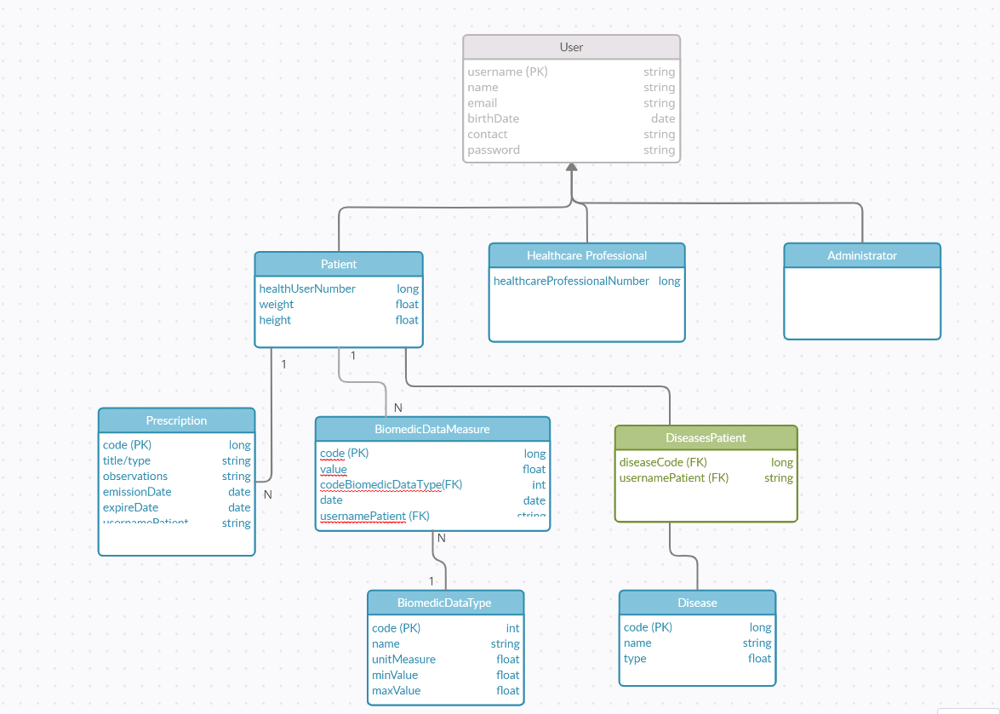

# Clinical Management System

## Overview

The main objective of this project is to develop a clinical enterprise application for managing biomedical data and signals of individuals with cardiovascular diseases.  
This repository showcases the front-end (client) of the application, built with **NUXT.JS**, while the backend is implemented in **JAVA**, and the environment is managed using **Docker**.

---

## Features by User Role

### Admin Account

#### Dashboard
- Displays various statistics.

#### Biometric Data Type
- Table features: pagination, sorting, filtering, downloads.
- CRUD operations:
  - **Create:** e.g., `Weight, 0, 600, kg, Kilo`.
  - **Edit:** Update the created entry without a maximum or modify, e.g., `Weight, 0, 600, kg, Quilo`.
  - **Delete:** Remove `Weight`.
  - **Restore:** Recover `Weight`.

#### Patient
- **Create:** With issues (e.g., `email = 2191266@my.ipleiria.pt` or `healthcareNo = 123456789`).
- **Edit/Delete/Restore** the created patient.

#### Healthcare Professionals
- **Create:** Add a new entry properly.
- **Edit:** Example entry `Bruna`—view prescriptions, observations, and associated patients.
- **Delete/Restore** the created entry.

#### Administrators
- **Create/Edit/Delete/Restore** administrators.

> **Note:** Soft-deleted users cannot authenticate.

---

### Healthcare Professional Account

#### Dashboard
- Displays the most recent prescription.

#### Patient
- **Edit:** Update details, view biometric data, observations, and more.
- Demonstrates the ability to create a patient.

#### Observation
- Edit observations and show related prescriptions/documents.
- Add `.pdf` documents.
- **Delete/Restore** observations.
- Create observations:
  - Without a prescription.
  - With a prescription.

#### Prescription
- Visual distinction between global and observation-specific prescriptions.
- Edit a prescription with an end date earlier than the current date; verify it becomes unmodifiable.
- **Delete/Restore/Create** global prescriptions.

> **Notes:**
> - Global prescriptions activate after creation or modification.  
> - Updates to global prescriptions revoke them from associated patients and reassign them post-modification.

#### Issues
- **Create:** Example: Issue for `Weight`.
- **Edit/Delete/Restore:** Manage the list of issues for a biometric data type.

#### Biometric Data
- **Delete/Restore/Create** biometric data.  
- View classifications, confirm patient notifications (emails), and global prescriptions received.  
- **Edit:** Verify updated classifications and prescription changes.  

> **Notes:**  
> Any changes (create/edit/delete/restore) recalculate the latest issue for the associated type.

---

### Patient Account

#### Accounts
- `219XXXX@my.ipleiria.pt/1234` // Daniel  
- `219XXX1@my.ipleiria.pt/1234` // Leonél  
- `219XXX2@my.ipleiria.pt/1234` // Andreia  
- `219XXX3@my.ipleiria.pt/1234` // Silvia  
- `219XXX4@my.ipleiria.pt/1234` // Manuel  
- `219XXX5@my.ipleiria.pt/1234` // Isabela  

#### Dashboard
- Displays:
  - Last Biometric Data.
  - Active Prescriptions.
  - Healthcare Professionals.

#### Biometric Data
- General features: search bar, sorting, downloads, pagination.
- View personal data and those created by healthcare professionals.
- CRUD operations on personal biometric data.

#### Prescriptions
- Displays only personal prescriptions.
- View details.

#### Observations
- Displays only personal observations.
- View details:
  - With documents.
  - With prescriptions and documents.

---

## Notifications

Emails are sent for the following events:
- Patient created/deleted/restored.
- Administrator created/deleted/restored.
- Healthcare Professional created/deleted/restored.
- Patient receives:
  - Global prescriptions.
  - Observation.
  - Specific prescriptions.
- Patient association with a healthcare professional.

---

## Extras

- Soft deletes.
- Import biometric data.
- Export all primary tables (by table or entity/request).
- Responsive front-end/mobile application.
- Email notifications.
- Documents in observations (upload/download).
- Statistics.